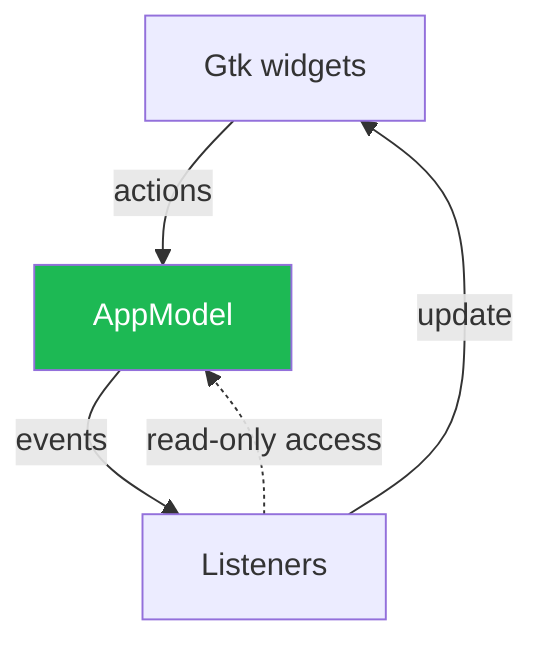
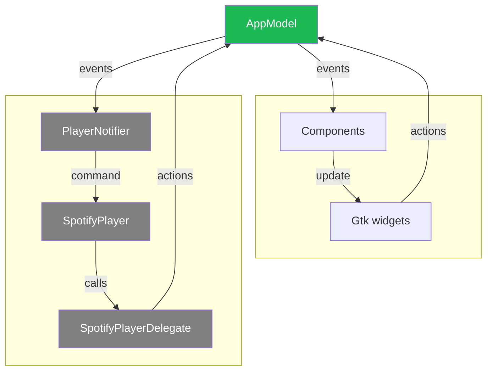
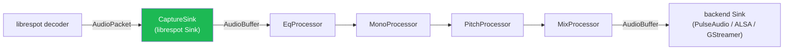

# Data flow within Riff

## Overview

**Single source of truth.** There is a single place that is considered the source of truth for anything that is related to the app state, and that is, well, the `AppState`. The app state aggregates the state of the UI, as well as the player state. This makes it easier to keep things in sync — when possible, anything state-related should be read from the app state over some local, possibly out-of-date state.

**Centralized.** That state is centralized and unique. This allows various parts of the application to access any part of it, and conversely makes it easy to perform state updates that affect various and sometimes unrelated parts of the application.

**Controlled mutations.** There is only one way to modify the app state, and that is by dispatching *actions* — plain structs that represent a mutation to the state. Updates to the state produce *events*, which `EventListeners` can use to update the UI.



*The data flow and its relation to the UI — the `AppModel` enforces read-only access to the state.*

This draws heavy inspiration from the Flux architecture; the one big difference here is that there is no way to automatically find out which portion of the UI should be updated. Instead, listeners are responsible for figuring out the updates to apply based on the events.

It should be noted that the app state is only readable from the main thread for simplicity.


## How actions are handled

Here is the relevant part of the code related to handling actions and notifying listeners:

```rust
let events = self.model.update_state(action);

for event in events.iter() {
    for listener in self.listeners.iter_mut() {
        listener.on_event(event);
    }
}
```

That first line is the only time that the app state is borrowed mutably — to apply actions.

On the technical side: all actions being dispatched, synchronous or not, are eventually sent through a `futures::channel::mpsc` channel. The consumer on the other end of the channel is a future that will be executed by GLib. This allows Gtk to process *all actions* at its own pace, as part of its main loop.

Note: futures are used a lot in the code to perform asynchronous operations such as calls to the Spotify API. To ease the use of futures, the dispatcher allows working with asynchronous actions, that is, futures that output one or more actions. Again, these futures are eventually handled in the main Gtk loop.

## A listener: the player subsystem

Any element that wishes to update the state or react to changes from the state has to follow that same pattern. For instance, the "player" part of Riff receives `Commands` (mapped from events by a `PlayerNotifier`) to start playing music, and dispatches actions back to the app through a `SpotifyPlayerDelegate` (see the figure below).

These two extra elements add some indirection so that the player is not too strongly coupled to the rest of the app (it does not and should not care about most events, afterall!). Moreover, those commands are handled in a separate thread where the player lives.



*The player subsystem.*

## The audio engine: a DSP pipeline

The `SpotifyPlayer` drives librespot, which decodes compressed audio into
interleaved `f64` PCM and hands each block to a librespot `Sink`. Rather than
writing those samples straight to the audio backend (PulseAudio / ALSA /
GStreamer), Riff inserts a processing layer — the **audio engine**
(`src/audio_engine/`) — between librespot and the backend.

The audio engine is built around three pieces:

- **`AudioBuffer`** — a block of interleaved PCM carrying its `channels` and
  `sample_rate`, so each stage is self-describing.
- **`Processor`** — a trait for a single in-place DSP stage. Each processor
  exposes `is_active()` (a diagnostic hint) and `process()`.
- **`ProcessorChain`** — an ordered list of processors applied in sequence.

The `CaptureSink` implements librespot's `Sink` trait; this is the boundary
where audio enters the pipeline. It wraps decoded samples in an `AudioBuffer`,
runs them through the chain, and forwards the result to the real backend sink.
Encoded/passthrough packets are forwarded untouched.



*The audio engine pipeline. Stages run in a fixed order.*

The chain currently contains a 10-band parametric equalizer, a mono downmix,
and stubs for pitch shifting and source mixing. New DSP features are added by
implementing `Processor` and inserting a stage into the chain.

**Live updates without interrupting playback.** Each processor is paired with a
*controller* (e.g. `EqController`, `MonoController`) that the `SpotifyPlayer`
holds and updates in response to `Command`s such as `SetEqualizer` and
`SetMono`. Controllers use a lock-free generation counter: the audio thread
cheaply checks the counter on every buffer and only takes a lock (or rebuilds
filters) when something actually changed. Because the chain always calls every
processor's `process()` — which refreshes its own configuration before
self-gating any expensive work — a stage that is toggled on mid-playback is
picked up on the very next buffer, and settings changes never require
recreating the librespot player.

## Authentication

Everything related to obtaining and persisting Spotify credentials lives in
`src/auth/`, a peer module to `player` and `api`:

- **`RiffOauthClient`** drives the OAuth2 authorization-code (PKCE) login flow,
  spawning a short-lived local HTTP server to receive the redirect callback
  (`login.html` is served as the browser-facing confirmation page).
- **`TokenStore`** persists credentials securely via the Secret Service
  (libsecret / GNOME Keyring) and caches them in memory.

The `player` subsystem uses `RiffOauthClient` to log in and refresh tokens,
while the `api` layer uses `TokenStore` to authenticate Web API requests.

## Another listener: the MPRIS subsystem

Similarly, the MPRIS subsystem follows that same pattern. It spawns a small DBUS server that translates DBUS messages to actions, and an `AppPlaybackStateListener` listens to incoming events.

One major difference is that the MPRIS server maintains its own state here, since the app state cannot be accessed from outside the main thread. To make sure this local state stays in sync, DBUS messages should not alter the local state directly — instead, we should wait for a roundtrip through the app and incoming events.

# Components

## Overview

Components are thin wrappers around Gtk widgets, dedicated to binding them so that they produce the right actions, and updating them when specific events occur by conforming to `EventListener`.

## Modeling interactions

Components should have some associated `struct` to model the interactions with the rest of the app. Let's consider the play/pause button as an example. Its behavior is defined in the `PlaybackModel`:

```rust
impl PlaybackModel {
    fn is_playing(&self) -> bool { /**/ }
    fn toggle_playback(&self) { /**/ }
}
```

What we need to make our button work is a way to know its current state (is a song playing?) and a way to change that state (toggling on activation). Note that it would be tempting to simply query the widget's state, which *should* be in sync with the actual playback state, but what we should really do instead is query the app state, which is the one source of truth for anything state-related.

Why do this? First, toggling the playback might fail (e.g. if no song is playing), but more importantly something else could alter the playback state (e.g. a DBUS query).

```rust
fn is_playing(&self) -> bool {
    self.app_model.get_state().playback.is_playing()
}
```

As for toggling the playback, remember that we can only mutate the state through actions (the `get_state` call above returns some `Deref<Target = AppState>`). In other words, we express what kind of action we want to perform, with no guarantee that it'll succeed.

```rust
fn toggle_playback(&self) {
    self.dispatcher.dispatch(PlaybackAction::TogglePlay.into());
}
```

## Binding the widget

All that's left is binding the widget to our model. By wrapping our model in an `Rc`, it becomes easy to clone it into the kind of `'static` closure Gtk needs.

```rust
// model is an Rc<PlaybackModel>
widget.connect_play_pause(clone!(@weak model => move || model.toggle_playback()));
```

Finally, we need our component to listen to relevant events, and update our widget accordingly.

```rust
impl EventListener for PlaybackControl {
    fn on_event(&mut self, event: &AppEvent) {
        match event {
            AppEvent::PlaybackEvent(PlaybackEvent::PlaybackPaused)
            | AppEvent::PlaybackEvent(PlaybackEvent::PlaybackResumed) => {
                let is_playing = self.model.is_playing();
                self.widget.set_playing(is_playing);
            }
            /**/
        }
    }
}
```
